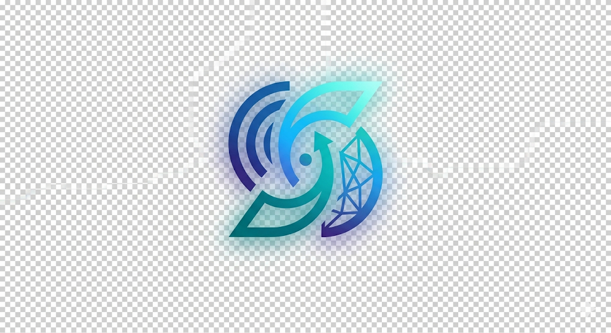

  
   
  
# Kinetix

*Your quiet corner of the internet.*

 

## Welcome to Kinetix

Welcome to **Kinetix**. We built this app because we believe your phone should work *for* you, not against you. In a world full of constant pings, rings, and notifications, finding focus can feel impossible. 

That's where Kinetix steps in. It's a completely private, on-device utility that magically adapts to your environment to give you the peace and quiet you need to get things done.

No robotic menus. No corporate jargon. Just a warm, human-centric app that understands when you need to be in the zone.

---

## What makes it special?

- **The "Flip-to-Focus" Shield**
  Just place your phone face down on your desk. That's it. Kinetix uses your device's accelerometer to instantly silence distractions. When you pick it back up, everything goes back to normal.
- **Themes that feel right**
  Whether you're a Neon night owl or a Forest morning person, Kinetix has a hand-tuned color palette just for you.
- **Celebrate your streaks**
  Every minute of focus compounds over time. Kinetix tracks your consecutive days of deep work to help you build a lasting habit, cheering you on every step of the way.
- **It knows the time of day**
  Open the app and you'll be greeted with a warm "Good morning" or "Late night", along with a fresh motivational quote to spark your productivity.
- **Cloud Syncing**
  Your focus logs, network targets, and profile details are securely synced to your private Supabase cloud database backend so you never lose your progress, while sensor metering remains local and optimized.

---

## Key Features Developed

Kinetix is built with several key features to make it a fully integrated cloud-connected productivity hub:

- **Supabase Cloud Database Syncing**
  Kinetix securely synchronizes your user profile, target Wi-Fi focus networks, and completed focus sessions in real-time with a Supabase cloud database.
- **Smart Auto-Fill & Persistent Log In**
  No more typing credentials on launch. Details are cached locally. The app auto-fills your gateway inputs and keeps you logged in across restarts.
- **Unified Navigation Backstack**
  The Home (Main) screen acts as the root destination. If you're not logged in, the login gateway is pushed reactively on top, letting you click the back button to view the dashboard as a guest.
- **In-App Profile Dialog & Theme Selection**
  Tapping the profile icon next to the greeting opens a premium profile dialog displaying your User Name, Email, Password, and Supabase ID. You can also switch color theme presets directly inside this pop-up box!
- **Foreground Accelerometer Gestures**
  Features a real-time accelerometer listener running inside a Foreground Service, automatically silencing the phone when stationary face-down, and restoring ringer modes instantly when picked up.
- **Targeted Wi-Fi Focus Auto-activation**
  Features background Wi-Fi job scheduling that distinguishes between Office (auto-enable focus DND) and Home (skip DND) environments.

---

## Dynamic User Interface and Motion System

Kinetix features a hardware-accelerated interface designed to behave like real-world physical elements:

- **Interactive Bottom Navigation Bar**
  Places critical screens (Focus, History, Logs) directly in thumb's reach, standardizing corner radii and layout padding across all views.
- **Theme-Aware Skeleton Loading Screen**
  Mimics the dashboard layout using a visual shimmer pattern that pulses in color tones of the active theme color preset during startup.
- **Dynamic Animated Vector Background**
  A custom drawn canvas featuring parallel wavy lines, double-shadowed circles, floating square blocks, and dot matrices. The colors dynamically shift and blend transparently to align with whichever color theme is selected.
- **Physics-Based Spring Transitions**
  Uses spring curves for horizontal sliding transitions when navigating between tabs and bouncy scale feedback for the central focus controls.
- **Pressed Depth Shadows**
  Interactive card containers feature press-reactive elevation shadows that flatten slightly upon click to simulate physical material compression.
- **Keyframe-Based Input Field Shaking**
  Text inputs perform a horizontal physics-based shake offset when login validation fails to denote tactile resistance.
- **Guided Onboarding Stepper**
  An interactive step-by-step onboarding tutorial dialog popup that guides new users through the app's features upon first login, storing completion preferences in local shared configuration.

---

## For the developers

We poured a lot of love into the technical foundation of Kinetix:

- **Language:** Kotlin
- **UI:** Jetpack Compose & Material 3
- **Database Backend:** Supabase Cloud Integration via REST API (fully offline-resilient)
- **Architecture:** MVVM with clean StateFlow streams
- **Typography:** Custom Domine Serif integrated globally
- **Background Magic:** JobScheduler for Wi-Fi tracking & Foreground Services for gesture metering

### Want to run it yourself?

It's super simple to get started:

1. Clone this repository to your machine.
2. Open the `DigitalSilhouette` folder in **Android Studio** *(we kept the old folder name for legacy reasons!)*.
3. Hit the **Run** button to install it on your emulator or physical device.

*Note: On your first launch, the app will gently ask for Notification and Do Not Disturb permissions so it can do its job properly.*

---

## Join the journey

We'd love your help in making Kinetix even better! If you have an idea, find a bug, or just want to say hi, feel free to open an issue or submit a pull request.

  <i>"Focus is not about saying yes. It's about saying no."</i>
    
  <b>Developed by Advaith</b>

